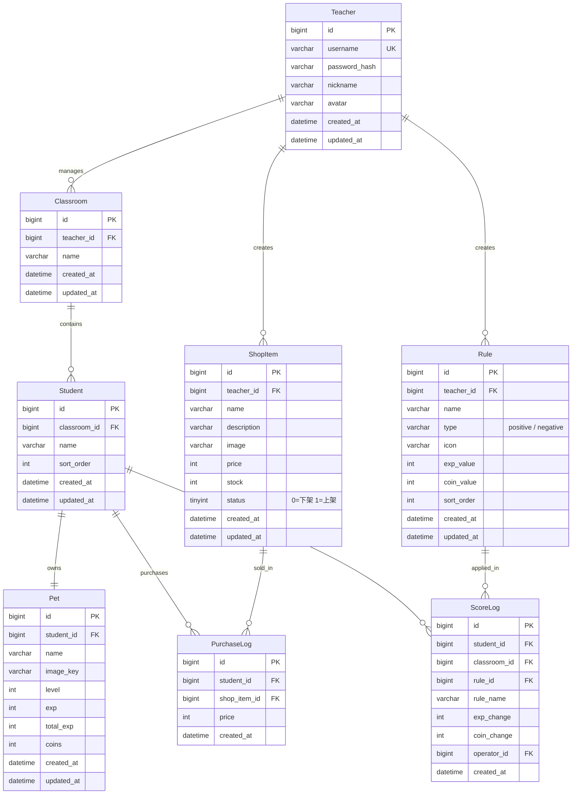
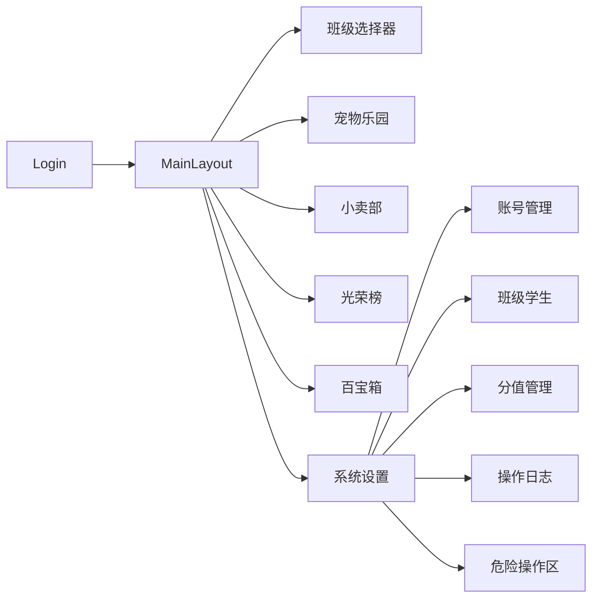
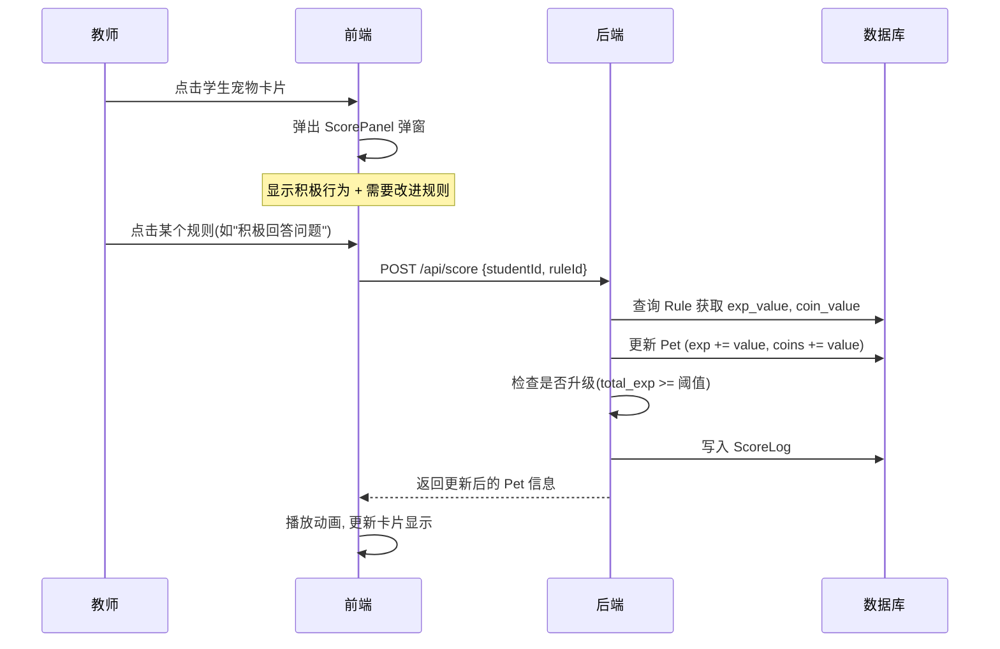

# 积分养宠物学生管理系统 - 架构设计文档

## 一、技术选型

- **前端**: Vue 3 + Vite + TypeScript + Pinia + Vue Router + TailwindCSS + Element Plus
- **后端**: Java 17 + Spring Boot 3 + MyBatis-Plus + Spring Security + JWT
- **数据库**: MySQL 8
- **构建**: Maven (后端), pnpm (前端)

## 二、项目目录结构

### 后端 `backend/`

```
backend/
├── pom.xml
├── src/main/java/com/petclass/
│   ├── PetClassApplication.java
│   ├── config/
│   ├── common/
│   ├── entity/
│   ├── mapper/
│   ├── service/
│   ├── controller/
│   ├── dto/
│   └── vo/
├── src/main/resources/
│   ├── application.yml
│   └── db/schema.sql
```

### 前端 `frontend/`

```
frontend/
├── src/
│   ├── api/
│   ├── router/
│   ├── stores/
│   ├── types/
│   ├── utils/
│   ├── layouts/
│   ├── views/
│   └── components/
```

## 三、数据库表

- teacher, classroom, student, pet, rule, score_log, shop_item, purchase_log

## 四、宠物等级体系

| 等级 | 所需累计经验 |
|------|------------|
| Lv.1 | 0          |
| Lv.2 | 10         |
| Lv.3 | 25         |
| Lv.4 | 50         |
| Lv.5 | 100        |


---
name: 积分养宠物学生管理系统
overview: 基于 Spring Boot + Vue 3 + MySQL 构建一个课堂积分养宠物管理系统，教师可通过行为评分影响学生宠物的经验值和金币，含宠物乐园、小卖部、光荣榜、系统设置等核心模块。
todos:
  - id: init-backend
    content: 初始化 Spring Boot 后端项目结构 (pom.xml, 目录, application.yml)
    status: in_progress
  - id: init-frontend
    content: 初始化 Vue 3 + Vite + TailwindCSS + Element Plus 前端项目
    status: pending
  - id: db-schema
    content: 编写 MySQL 建表 SQL (8张表)
    status: in_progress
  - id: backend-auth
    content: 实现认证模块 (Spring Security + JWT + 登录注册)
    status: in_progress
  - id: backend-core
    content: "实现核心业务: 班级/学生/宠物/规则/打分 CRUD"
    status: in_progress
  - id: backend-shop-log
    content: 实现小卖部和操作日志模块
    status: in_progress
  - id: frontend-layout
    content: "实现前端布局: 登录页 + 主布局 + 路由 + 导航"
    status: pending
  - id: frontend-petgarden
    content: 实现宠物乐园页面 + 打分弹窗
    status: pending
  - id: frontend-leaderboard-shop
    content: 实现光荣榜和小卖部页面
    status: pending
  - id: frontend-settings
    content: "实现系统设置: 账号/班级学生/分值管理/操作日志"
    status: pending
  - id: pet-assets
    content: 准备宠物图片资源和等级系统
    status: pending
isProject: false
---

# 积分养宠物学生管理系统 - 架构设计文档

## 一、技术选型

- **前端**: Vue 3 + Vite + TypeScript + Pinia + Vue Router + TailwindCSS + Element Plus
  - TailwindCSS 实现截图中圆角卡片、渐变色等自定义 UI
  - Element Plus 提供表单、表格、弹窗等基础组件
- **后端**: Java 17 + Spring Boot 3 + MyBatis-Plus + Spring Security + JWT
- **数据库**: MySQL 8
- **构建**: Maven (后端), pnpm (前端)

---

## 二、项目目录结构

### 后端 `backend/`

```
backend/
├── pom.xml
├── src/main/java/com/petclass/
│   ├── PetClassApplication.java
│   ├── config/
│   │   ├── SecurityConfig.java          # Spring Security + JWT 配置
│   │   ├── CorsConfig.java              # 跨域配置
│   │   └── MyBatisPlusConfig.java       # 分页插件等
│   ├── common/
│   │   ├── Result.java                  # 统一响应封装 {code, msg, data}
│   │   ├── GlobalExceptionHandler.java  # 全局异常处理
│   │   └── JwtUtils.java               # JWT 工具类
│   ├── entity/
│   │   ├── Teacher.java
│   │   ├── Classroom.java
│   │   ├── Student.java
│   │   ├── Pet.java
│   │   ├── Rule.java
│   │   ├── ScoreLog.java
│   │   ├── ShopItem.java
│   │   └── PurchaseLog.java
│   ├── mapper/                          # MyBatis-Plus Mapper 接口
│   ├── service/                         # 业务逻辑层
│   │   ├── impl/                        # 实现类
│   ├── controller/
│   │   ├── AuthController.java          # 登录/注册/修改密码
│   │   ├── ClassroomController.java     # 班级 CRUD
│   │   ├── StudentController.java       # 学生 CRUD + 批量导入
│   │   ├── PetController.java           # 宠物领养/信息/升级
│   │   ├── RuleController.java          # 评分规则 CRUD
│   │   ├── ScoreController.java         # 打分操作(加分/减分)
│   │   ├── ShopController.java          # 商品上架/购买
│   │   └── LeaderboardController.java   # 光荣榜排行
│   ├── dto/                             # 请求参数对象
│   └── vo/                              # 响应视图对象
├── src/main/resources/
│   ├── application.yml
│   ├── mapper/                          # XML 映射文件(如需)
│   └── db/
│       └── schema.sql                   # 建表 SQL
```

### 前端 `frontend/`

```
frontend/
├── package.json
├── vite.config.ts
├── tailwind.config.js
├── tsconfig.json
├── index.html
├── public/
│   └── pets/                            # 宠物静态图片资源
├── src/
│   ├── main.ts
│   ├── App.vue
│   ├── api/                             # Axios 请求封装
│   │   ├── request.ts                   # Axios 实例(拦截器/JWT)
│   │   ├── auth.ts
│   │   ├── classroom.ts
│   │   ├── student.ts
│   │   ├── pet.ts
│   │   ├── rule.ts
│   │   ├── score.ts
│   │   ├── shop.ts
│   │   └── leaderboard.ts
│   ├── router/
│   │   └── index.ts                     # 路由配置 + 导航守卫
│   ├── stores/                          # Pinia 状态管理
│   │   ├── auth.ts
│   │   ├── classroom.ts
│   │   └── app.ts
│   ├── types/
│   │   └── index.ts                     # TypeScript 类型定义
│   ├── utils/
│   │   └── petLevel.ts                  # 宠物等级计算工具
│   ├── layouts/
│   │   ├── MainLayout.vue               # 主布局(顶部导航+班级选择)
│   │   └── SettingsLayout.vue           # 设置页左侧菜单布局
│   ├── views/
│   │   ├── Login.vue                    # 登录页
│   │   ├── PetGarden.vue                # 宠物乐园(主页)
│   │   ├── Shop.vue                     # 课堂小卖部
│   │   ├── Leaderboard.vue              # 光荣榜
│   │   ├── TreasureBox.vue              # 百宝箱
│   │   └── settings/
│   │       ├── AccountManagement.vue    # 账号管理
│   │       ├── ClassStudents.vue        # 班级学生管理
│   │       ├── RuleManagement.vue       # 分值管理
│   │       ├── OperationLogs.vue        # 操作日志
│   │       └── DangerZone.vue           # 危险操作区
│   └── components/
│       ├── PetCard.vue                  # 宠物卡片组件
│       ├── ScorePanel.vue               # 打分弹窗面板
│       ├── LeaderboardPodium.vue        # 排行榜领奖台
│       ├── RuleCard.vue                 # 规则卡片
│       ├── ShopItemCard.vue             # 商品卡片
│       ├── ClassSelector.vue            # 班级选择器
│       └── PetEggSelector.vue           # 宠物蛋选择器
```

---

## 三、数据库设计 (ER 关系)




### 宠物等级体系


| 等级   | 所需累计经验 | 升级所需 |
| ---- | ------ | ---- |
| Lv.1 | 0      | -    |
| Lv.2 | 10     | 10   |
| Lv.3 | 25     | 15   |
| Lv.4 | 50     | 25   |
| Lv.5 | 100    | 50   |


- `total_exp` 记录历史累计经验(只增不减，用于等级计算和排行)
- `exp` 记录当前等级内的经验进度
- `coins` 可消费(在小卖部购买后扣减)

---

## 四、核心 API 设计

### 认证模块

- `POST /api/auth/login` - 教师登录，返回 JWT token
- `POST /api/auth/register` - 教师注册
- `PUT /api/auth/password` - 修改密码

### 班级模块

- `GET /api/classrooms` - 获取当前教师的所有班级
- `POST /api/classrooms` - 创建班级
- `PUT /api/classrooms/{id}` - 重命名班级
- `DELETE /api/classrooms/{id}` - 删除班级

### 学生模块

- `GET /api/classrooms/{classId}/students` - 获取班级学生列表(含宠物信息)
- `POST /api/classrooms/{classId}/students` - 添加学生(支持批量)
- `PUT /api/students/{id}` - 修改学生姓名
- `DELETE /api/students/{id}` - 移除学生

### 宠物模块

- `POST /api/students/{studentId}/pet` - 领养宠物(选择宠物蛋)
- `GET /api/students/{studentId}/pet` - 获取宠物详情
- `PUT /api/pets/{id}/name` - 修改宠物名称

### 打分模块 (核心)

- `POST /api/score` - 给学生打分 `{studentId, ruleId}`
- `POST /api/score/batch` - 批量打分 `{studentIds[], ruleId}`
- 打分后自动更新 Pet 的 exp/coins/level，并写入 ScoreLog

### 规则模块

- `GET /api/rules` - 获取当前教师的所有规则(分 positive/negative)
- `POST /api/rules` - 新建规则
- `PUT /api/rules/{id}` - 编辑规则
- `DELETE /api/rules/{id}` - 删除规则

### 小卖部模块

- `GET /api/shop/items` - 获取商品列表
- `POST /api/shop/items` - 上架商品
- `PUT /api/shop/items/{id}` - 编辑商品
- `DELETE /api/shop/items/{id}` - 下架商品
- `POST /api/shop/purchase` - 学生购买商品 `{studentId, itemId}`

### 光荣榜

- `GET /api/leaderboard/pet?classId=xx` - 宠物榜(按 total_exp 排序)
- `GET /api/leaderboard/coin?classId=xx` - 金币榜(按 coins 排序)

### 操作日志

- `GET /api/operations/recent?classId=xx&startDate=xx&endDate=xx&limit=20` - 查询最近操作
- `POST /api/operations/{id}/revert` - 撤回一条可逆操作

---

## 五、前端页面与交互流程

### 主导航结构




### 核心交互: 打分流程




### 关键页面说明

- **宠物乐园 (PetGarden.vue)**: 网格展示所有学生的宠物卡片，每张卡片显示宠物图、等级、学生名、宠物名、经验进度条、金币数。点击卡片弹出 ScorePanel。右上角有"批量"按钮支持多选打分。
- **打分弹窗 (ScorePanel.vue)**: 左侧积极行为(绿色边框)，右侧需要改进(粉色边框)。每条规则显示名称、图标、EXP 和金币变化值。底部显示"最近操作记录"入口。
- **光荣榜 (Leaderboard.vue)**: 标签切换宠物榜/金币榜。前三名用领奖台样式(中间最高为第1名)，第4名起用列表展示。
- **小卖部 (Shop.vue)**: 商品网格，每个商品显示名称、图片、价格。教师视角有"补货上架"按钮。
- **系统设置**: 左侧菜单导航，右侧内容区。

---

## 六、安全与部署

- JWT Token 存储在 localStorage，Axios 拦截器自动附加 Authorization 头
- 后端所有 `/api/`** 路由需要 JWT 认证，`/api/auth/`** 除外
- 前端 Vue Router 导航守卫检查登录状态
- 开发环境: Vite 代理到 Spring Boot (localhost:8080)
- 生产环境: 前端 build 后由 Nginx 托管，API 反向代理到 Spring Boot

---

## 七、宠物图片资源方案

- 内置 8-12 种宠物形象(猫、狗、兔、虎、猪、企鹅、仓鼠等)，对应截图中的风格
- 每种宠物有多个等级外观(Lv.1 蛋/幼年, Lv.2 成长, Lv.3+ 成熟)
- 图片以 `image_key` 标识，存放在 `public/pets/` 目录
- 命名规则: `{type}_{level}.png`，如 `cat_1.png`, `cat_2.png`


